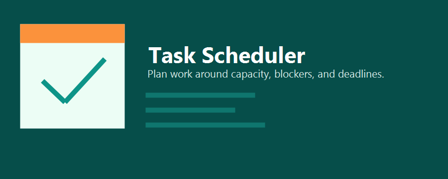

# Task Scheduler for OpenAI Codex

Task Scheduler is an OpenAI Codex plugin that turns raw task lists into realistic schedules.

It combines three pieces in one plugin package:

- a Codex plugin manifest and marketplace-ready metadata
- a reusable MCP server that other agents and tools can call
- a local CLI for generating schedule drafts from structured JSON input

The plugin is designed for practical planning. It balances deadlines, available hours, blocked dates, and per-day capacity changes, then returns a markdown plan with follow-ups and risks.



## Highlights

- Converts task JSON into a day-by-day schedule
- Supports blocked dates and daily capacity overrides
- Tracks overflow when tasks do not fit inside the planning window
- Exposes MCP tools so other agents can call the scheduler directly
- Includes a Codex skill for planning-oriented prompts
- Ships with example assets, sample data, and starter plugin metadata

## Who This Is For

- Codex users who want a local productivity plugin
- plugin authors learning how to combine plugin manifests, skills, and MCP
- teams that want a lightweight planning tool agents can call from the same workspace

## Repository Layout

```text
task-scheduler/
|-- .codex-plugin/
|   `-- plugin.json
|-- assets/
|   |-- icon.png
|   |-- logo.png
|   `-- screenshot*.png
|-- hooks/
|   `-- README.md
|-- scripts/
|   |-- build_schedule.py
|   |-- example_tasks.json
|   |-- mcp_server.py
|   |-- requirements-mcp.txt
|   `-- task_scheduler_core.py
|-- skills/
|   `-- task-planner/
|       `-- SKILL.md
|-- .app.json
|-- .mcp.json
|-- hooks.json
`-- README.md
```

## Features

### 1. Local CLI scheduling

Use the CLI when you want a quick schedule from a JSON file:

```powershell
python .\scripts\build_schedule.py `
  --input .\scripts\example_tasks.json
```

Optional flags:

- `--start-date YYYY-MM-DD`
- `--days <int>`
- `--hours-per-day <number>`
- `--output <path>`

These flags override the values inside the JSON input file when present.

### 2. MCP tools for agent workflows

The plugin exposes a local stdio MCP server so other agents and tools can call the scheduler without shelling out directly.

Implemented MCP tools:

- `build_task_schedule`
- `analyze_schedule_capacity`
- `build_task_schedule_from_file`

Implemented MCP resources:

- `task-scheduler://sample-input`
- `task-scheduler://readme`

Implemented MCP prompt:

- `schedule_prompt`

### 3. Codex skill support

The included skill at `skills/task-planner/SKILL.md` helps Codex gather constraints, create a realistic plan, and call out risk and overflow clearly.

## Input Format

The scheduler accepts either:

- a plain JSON array of tasks
- a JSON object containing `tasks` plus planning metadata

### Minimal input

```json
[
  {
    "title": "Finalize project brief",
    "due": "2026-04-03",
    "estimated_hours": 2.5,
    "priority": 5,
    "notes": "Needs stakeholder review"
  }
]
```

### Full input

```json
{
  "start_date": "2026-04-01",
  "days": 6,
  "hours_per_day": 6,
  "blocked_dates": ["2026-04-04"],
  "daily_capacity_overrides": {
    "2026-04-03": 3.5,
    "2026-04-06": 4
  },
  "notes": "Protect Saturday for admin catch-up.",
  "tasks": [
    {
      "title": "Finalize project brief",
      "due": "2026-04-02",
      "estimated_hours": 2,
      "priority": 5,
      "tags": ["strategy", "stakeholders"],
      "notes": "Share with stakeholders before noon."
    }
  ]
}
```

### Supported task fields

- `title`: task name
- `due`: due date in `YYYY-MM-DD`
- `estimated_hours`: expected work in hours
- `priority`: integer from 1 to 5
- `notes`: optional detail shown in output
- `tags`: optional string array for categorization

### Supported schedule metadata

- `start_date`: planning window start
- `days`: number of days in the window
- `hours_per_day`: default daily capacity
- `blocked_dates`: dates with zero scheduling capacity
- `daily_capacity_overrides`: per-day hour overrides
- `notes`: planning context echoed into the output

## Example Output

The generated markdown includes:

- `Summary`
- `Schedule`
- `Follow-Ups`
- `Risks`

This makes it readable for humans and easy for agents to refine.

## Installation

### 1. Clone or copy the repository

This repository is structured with the plugin at the repo root.

```text
task-scheduler-codex-plugin/
```

To use it as a Codex plugin inside another workspace, place this repository or a copy of it under:

```text
plugins/task-scheduler
```

### 2. Install the MCP dependency

```powershell
python -m pip install -r .\scripts\requirements-mcp.txt
```

### 3. Verify the plugin manifest

The manifest lives at:

```text
.codex-plugin/plugin.json
```

This plugin already references:

- `./skills/`
- `./hooks.json`
- `./.mcp.json`
- `./.app.json`

### 4. Verify the MCP config

The MCP config lives at:

```text
.mcp.json
```

It starts the local server with:

```json
{
  "mcpServers": {
    "taskScheduler": {
      "command": "python",
      "args": ["./scripts/mcp_server.py"],
      "cwd": "."
    }
  }
}
```

### 5. Optional marketplace registration

If you want the plugin to appear in Codex UI ordering, register it in your marketplace file:

```text
.agents/plugins/marketplace.json
```

This repo already includes a starter marketplace entry.

## Quick Start

### Run the CLI

```powershell
python .\scripts\build_schedule.py `
  --input .\scripts\example_tasks.json
```

### Start the MCP server directly

```powershell
python .\scripts\mcp_server.py
```

### Use the example data

Sample input lives at:

```text
scripts/example_tasks.json
```

## Documentation

- [Getting Started](./docs/GETTING_STARTED.md)
- [MCP Reference](./docs/MCP_REFERENCE.md)
- [Architecture](./docs/ARCHITECTURE.md)
- [Development Guide](./docs/DEVELOPMENT.md)
- [Publishing Guide](./docs/PUBLISHING.md)
- [Contributing](./CONTRIBUTING.md)
- [Security Policy](./SECURITY.md)
- [Privacy Policy](./PRIVACY.md)
- [Terms of Service](./TERMS.md)

## Current Status

This plugin is a strong local starter and learning reference. It is already useful for local scheduling and MCP-based planning flows, but a few areas are still intentionally starter-level:

- `.app.json` integration details
- runtime hook registrations in `hooks.json`
- final production screenshots and branding assets

## Roadmap Ideas

- add more MCP tools such as automatic overflow rescheduling
- support recurring tasks and dependency chains
- add export formats beyond markdown
- connect planner output to external task systems
- add repository releases and changelog automation

## License

MIT, unless you choose a different license for your public repository.
