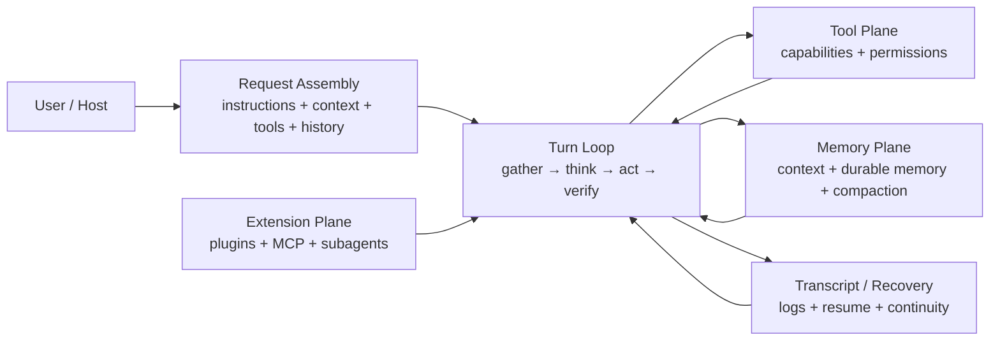

# Claude Code Harness

> Turn an agent idea into a real harness blueprint.

`claude-code-harness` is a public skill and plugin package for developers who want to design the runtime around an agent, not just the prompt inside it.

It is inspired by Claude Code's harness design and generalized into a reusable pattern language for building agentic systems with clearer request assembly, tighter control loops, safer tool boundaries, and stronger recovery behavior.

This project is unofficial. It is not affiliated with Anthropic.

## What a harness is

A harness is the layer that turns a model into an operating system for work.

It decides:

- how a request is assembled
- how a turn progresses
- what tools exist and how they are governed
- what memory survives which boundary
- what gets logged, resumed, compacted, or escalated
- how a human can still understand and control the system



## Why this repo exists

Most agent projects still stop at one of these weak states:

- a prompt with a tool list
- a loop with no governance
- memory with no boundaries
- autonomy with no control surface
- retries with no recovery model

This repo is meant to force a higher bar.

The question it keeps asking is:

**What is the harness here, exactly?**

## What this skill does

This repository currently ships one skill:

- `claude-code-harness`

The skill helps you produce a **harness blueprint** for an agentic system. It pushes you to specify the runtime planes that are usually hand-waved away.

| Plane | What the skill forces you to define |
|------|--------------------------------------|
| Request assembly | instruction sources, system/user context, tool exposure, transcript normalization |
| Turn loop | gather, decide, act, verify, stop/retry/escalate |
| Tool plane | capability contracts, permission gates, success criteria, rollback story |
| Memory plane | active context, retrieval, durable memory, compaction |
| Recovery plane | transcript, resumability, partial work, continuity |
| Human control | approvals, visibility, interruption, auditability |
| Extension plane | plugins, MCP, subagents, future expansion points |

## When to use it

Use this skill when you need to answer questions like:

- What is the runtime shape of this agent?
- How should we assemble each model request?
- What are the real boundaries between loop, tools, memory, and persistence?
- Where should permissions and approvals live?
- How would this system recover from interruption or partial failure?

Do **not** use it when you only need:

- a better prompt
- a generic product brainstorm
- a feature list for an AI app
- plain implementation tasks with no runtime design problem

## How this differs from `claude-code-philosophy`

`claude-code-philosophy` is broader. It helps people design better agentic products in general.

`claude-code-harness` is narrower and sharper. It is specifically about the runtime architecture around the model:

- request assembly
- control loop
- capabilities
- memory boundaries
- transcript and recovery

If `claude-code-philosophy` asks “what kind of agent product should this become?”, this repo asks “what harness must exist for that product to actually work?”

## What a good output looks like

When the skill is doing its job, the result should look like a blueprint, not a pep talk.

The default output shape includes:

1. system goal and delegation boundary
2. harness layers
3. request assembly design
4. turn loop design
5. tool runtime and permission boundaries
6. memory and context strategy
7. transcript and recovery model
8. extension surfaces
9. build order

## Quick install

| Platform | Install | Invoke |
|---------|---------|--------|
| Codex | `$skill-installer install https://github.com/dadwadw233/claude-code-harness/tree/main/skills/claude-code-harness` | `$claude-code-harness` |
| Claude Code plugin | `/plugin marketplace add dadwadw233/claude-code-harness` then `/plugin install claude-code-harness@claude-code-harness` | `/claude-code-harness:claude-code-harness` |
| Claude Code standalone | copy `skills/claude-code-harness` to `~/.claude/skills/claude-code-harness` | `/claude-code-harness` |

Restart Codex after installing a new skill.

## Example prompts

### Codex

- `Use $claude-code-harness to design a harness for this coding agent.`
- `Use $claude-code-harness to turn this vague operator idea into a runtime blueprint.`
- `Use $claude-code-harness to decide whether this workflow needs a real harness or just a simpler script.`

### Claude Code plugin install

- `/claude-code-harness:claude-code-harness`
- `/claude-code-harness:claude-code-harness Design a harness for a repo-writing agent with request assembly, permissions, and recovery.`

### Claude Code standalone skill install

- `/claude-code-harness`
- `/claude-code-harness Review whether this multi-agent idea really has a coherent harness.`

## Advanced install notes

### Codex local plugin install

```bash
git clone git@github.com:dadwadw233/claude-code-harness.git
mkdir -p ~/.codex/plugins
cp -R /absolute/path/to/claude-code-harness ~/.codex/plugins/claude-code-harness
```

Create or update `~/.agents/plugins/marketplace.json`:

```json
{
  "name": "personal-plugins",
  "interface": {
    "displayName": "Personal Plugins"
  },
  "plugins": [
    {
      "name": "claude-code-harness",
      "source": {
        "source": "local",
        "path": "./.codex/plugins/claude-code-harness"
      },
      "policy": {
        "installation": "AVAILABLE",
        "authentication": "ON_INSTALL"
      },
      "category": "Productivity"
    }
  ]
}
```

### Claude Code manual install

```bash
mkdir -p ~/.claude/skills
cp -R skills/claude-code-harness ~/.claude/skills/claude-code-harness
```

## Reference files

The skill itself stays concise. Depth lives in the references:

- `harness-principles.md`
  What a harness is, why it matters, and why request assembly is central.
- `harness-pattern-language.md`
  A reusable vocabulary for runtime planes such as request assembler, turn loop, transcript spine, and recovery plane.
- `harness-blueprint-template.md`
  The exact blueprint shape the skill should produce.
- `claude-code-derived-insights.md`
  The Claude Code-inspired lessons that were generalized into this skill.

## Repository structure

```text
.
├── .claude-plugin/
│   ├── marketplace.json
│   └── plugin.json
├── .codex-plugin/
│   └── plugin.json
├── .agents/plugins/
│   └── marketplace.json
└── skills/
    └── claude-code-harness/
        ├── SKILL.md
        ├── LICENSE.txt
        ├── agents/
        │   └── openai.yaml
        └── references/
            ├── claude-code-derived-insights.md
            ├── harness-blueprint-template.md
            ├── harness-pattern-language.md
            └── harness-principles.md
```

## Design stance

This project is opinionated.

It prefers:

- smaller loops over theatrical orchestration
- explicit control planes over vague autonomy
- bounded power over hidden power
- recoverability over one-shot cleverness
- runtime architecture over prompt mysticism

## Inspiration

This repo is strongly informed by:

- Claude Code's request assembly and runtime structure
- Claude Code's turn loop, memory maintenance, and transcript/recovery model
- official OpenAI/Codex skill and plugin conventions
- Claude Code plugin and marketplace conventions
- broader agent skills repositories that present skills as shareable, reusable building blocks

## Non-goals

This project is not trying to:

- clone Claude Code
- be a full agent framework
- make every workflow autonomous
- replace implementation with architecture theater

It is trying to help developers design stronger harnesses.
